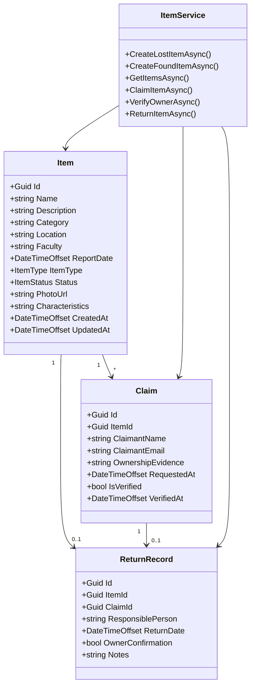

# Diagrama de clases

```mermaid
classDiagram
    class Item {
        +Guid Id
        +string Name
        +string Description
        +string Category
        +string Location
        +string Faculty
        +DateTimeOffset ReportDate
        +ItemType ItemType
        +ItemStatus Status
        +string PhotoUrl
        +string Characteristics
        +DateTimeOffset CreatedAt
        +DateTimeOffset UpdatedAt
    }

    class Claim {
        +Guid Id
        +Guid ItemId
        +string ClaimantName
        +string ClaimantEmail
        +string OwnershipEvidence
        +DateTimeOffset RequestedAt
        +bool IsVerified
        +DateTimeOffset VerifiedAt
    }

    class ReturnRecord {
        +Guid Id
        +Guid ItemId
        +Guid ClaimId
        +string ResponsiblePerson
        +DateTimeOffset ReturnDate
        +bool OwnerConfirmation
        +string Notes
    }

    class ItemService {
        +CreateLostItemAsync()
        +CreateFoundItemAsync()
        +GetItemsAsync()
        +ClaimItemAsync()
        +VerifyOwnerAsync()
        +ReturnItemAsync()
    }

    Item "1" --> "*" Claim
    Item "1" --> "0..1" ReturnRecord
    Claim "1" --> "0..1" ReturnRecord
    ItemService --> Item
    ItemService --> Claim
    ItemService --> ReturnRecord
```
