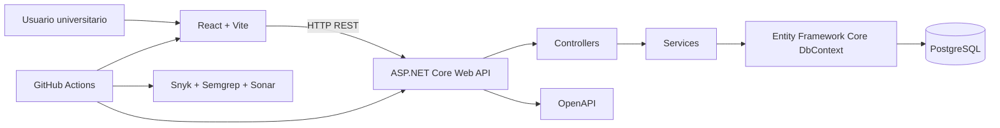

# Diagrama de componentes

```mermaid
flowchart LR
    User[Usuario universitario] --> Frontend[React + Vite]
    Frontend -->|HTTP REST| Api[ASP.NET Core Web API]
    Api --> Controllers[Controllers]
    Controllers --> Services[Services]
    Services --> DbContext[Entity Framework Core DbContext]
    DbContext --> PostgreSQL[(PostgreSQL)]
    Api --> OpenAPI[OpenAPI]
    Workflows[GitHub Actions] --> Api
    Workflows --> Frontend
    Workflows --> Security[Snyk + Semgrep + Sonar]
```
