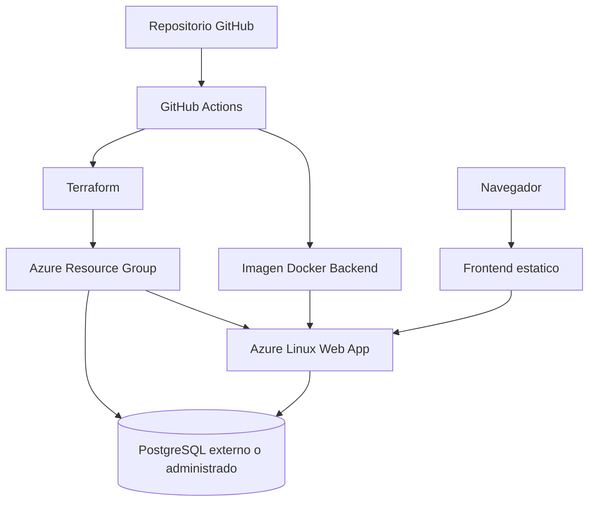

# Diagrama de despliegue

```mermaid
flowchart TB
    Dev[Repositorio GitHub] --> Actions[GitHub Actions]
    Actions --> Docker[Imagen Docker Backend]
    Actions --> Terraform[Terraform]
    Terraform --> AzureRG[Azure Resource Group]
    AzureRG --> WebApp[Azure Linux Web App]
    AzureRG --> Db[(PostgreSQL externo o administrado)]
    Docker --> WebApp
    Browser[Navegador] --> Frontend[Frontend estatico]
    Frontend --> WebApp
    WebApp --> Db
```
