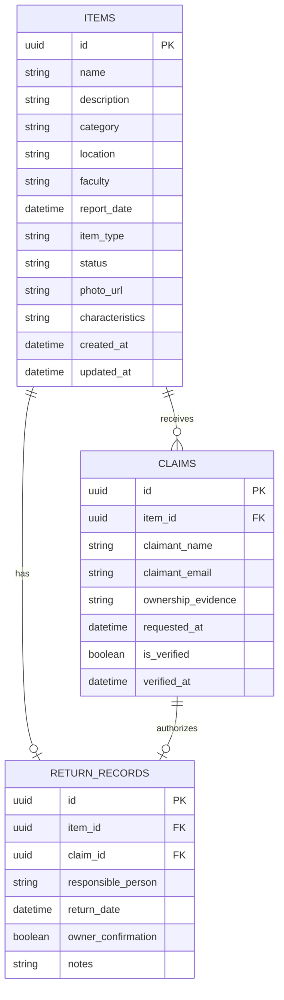

# Diagrama entidad-relacion

```mermaid
erDiagram
    ITEMS ||--o{ CLAIMS : receives
    ITEMS ||--o| RETURN_RECORDS : has
    CLAIMS ||--o| RETURN_RECORDS : authorizes

    ITEMS {
        uuid id PK
        string name
        string description
        string category
        string location
        string faculty
        datetime report_date
        string item_type
        string status
        string photo_url
        string characteristics
        datetime created_at
        datetime updated_at
    }

    CLAIMS {
        uuid id PK
        uuid item_id FK
        string claimant_name
        string claimant_email
        string ownership_evidence
        datetime requested_at
        boolean is_verified
        datetime verified_at
    }

    RETURN_RECORDS {
        uuid id PK
        uuid item_id FK
        uuid claim_id FK
        string responsible_person
        datetime return_date
        boolean owner_confirmation
        string notes
    }
```
